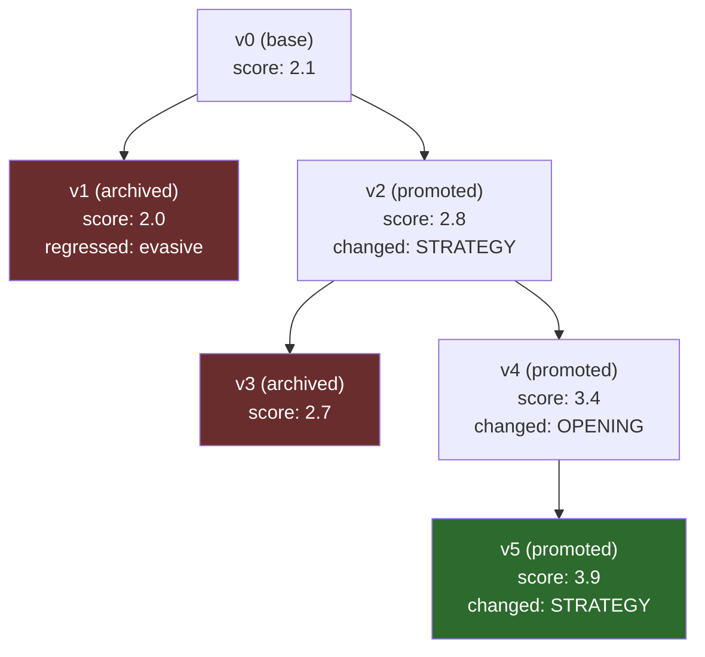

# Darwin-Gödel Self-Evolving Voice Agent — System Design Document

> **Purpose**: This document is the single source of truth for implementing the self-evolving debt collection voice agent. It covers architecture, strategies, data models, module responsibilities, and implementation details. Written to be consumed by both humans and AI coding agents.

---

## Table of Contents

1. [Project Overview](#1-project-overview)
2. [Architecture Overview](#2-architecture-overview)
3. [Directory Structure](#3-directory-structure)
4. [Core Data Models](#4-core-data-models)
5. [Prompt Architecture](#5-prompt-architecture)
6. [Persona Design](#6-persona-design)
7. [Simulation Engine](#7-simulation-engine)
8. [Evaluation System](#8-evaluation-system)
9. [Failure Analysis](#9-failure-analysis)
10. [Mutation Strategy](#10-mutation-strategy)
11. [Selection & Promotion](#11-selection--promotion)
12. [Evolution Loop Orchestration](#12-evolution-loop-orchestration)
13. [Pipecat Voice Pipeline](#13-pipecat-voice-pipeline)
14. [Dashboard & Visualization](#14-dashboard--visualization)
15. [CLI Entrypoints](#15-cli-entrypoints)
16. [Configuration & Environment](#16-configuration--environment)
17. [Cost Estimation](#17-cost-estimation)
18. [Key Design Decisions & Rationale](#18-key-design-decisions--rationale)
19. [References & Prior Art](#19-references--prior-art)

---

## 1. Project Overview

### What We're Building

A platform that **automatically evolves** a debt collection voice agent's prompts through simulated conversations, automated evaluation, failure analysis, and targeted prompt mutation — without human intervention.

### Assignment Requirements Mapping

| Requirement | Where It's Addressed |
|---|---|
| Voice bot with Pipecat | `voice/` module, Section 13 (SmallWebRTCTransport) |
| Configurable prompts per agent version | `core/archive.py` + `core/prompt_builder.py`, Section 5 |
| Modular (prompt layer, logic layer, voice frontend) | Three independent subsystems, Section 2 |
| Works locally | SmallWebRTCTransport (P2P, no cloud infra), Section 13 |
| 5 simulated personas | `config/personas.py`, Section 6 |
| Randomized stress testing | Randomized surface details per conversation, Section 6 |
| 3+ scoring metrics | Goal completion, conversational quality, compliance, Section 8 |
| Automated evaluation (no manual scoring) | Three-judge LLM panel, Section 8 |
| Persistent agent archive | `core/archive.py`, DAG structure, Section 4 |
| Prompt/script + score + change history per version | `AgentVersion` model, Section 4 |
| Parent selection → foundation model rewrite | `evolution/mutator.py`, Section 10 |
| Reasoning from logs + failures | `evolution/failure_analyzer.py`, Section 9 |
| Fork new versions + empirical testing | 2 candidates per generation, Section 10 |
| Promote best performers | Regression-aware selection, Section 11 |
| User-defined success threshold | Configurable threshold + plateau + budget, Section 12 |
| Logs of failed branches | `status: "archived"` in archive, Section 4 |
| Rationale for each change | `rationale` field per version, Section 4 |
| Link to failures it addresses | `failure_patterns` field per version, Section 4 |
| Final prompt in voice agent | `scripts/run_voice.py --version <champion>`, Section 15 |
| Voice conversation possible | Pipecat pipeline, Section 13 |
| Audio recording deliverable | Record from Pipecat session, Section 13 |
| Version archive / eval scores / prompt changes logs | Archive JSON files + HTML report, Section 14 |
| 2-3 min demo | Dashboard HTML report + live voice demo, Section 14 |

---

## 2. Architecture Overview

Three independent subsystems communicating through a shared data layer:

```
┌─────────────────────────────────────────────────────┐
│                    SHARED DATA LAYER                │
│    Archive (data/archive/)  +  Logs (data/conversations/)   │
└──────────┬──────────────┬──────────────┬────────────┘
           │              │              │
    ┌──────▼──────┐ ┌─────▼──────┐ ┌────▼─────────┐
    │  EVOLUTION  │ │   VOICE    │ │ VISUALIZATION │
    │   ENGINE    │ │  FRONTEND  │ │   & REPORTS   │
    └─────────────┘ └────────────┘ └──────────────┘
```

**Independence guarantee**: Each subsystem can run standalone.
- Evolution engine runs text-only simulations — no voice dependency
- Voice frontend reads a prompt version from archive — no evolution dependency
- Dashboard reads archive data — no dependency on either

### Dependency Flow (strict, no circular deps)

```
config/          ← depends on nothing
core/            ← depends on config
simulation/      ← depends on core
evaluation/      ← depends on core
evolution/       ← depends on simulation, evaluation, core
voice/           ← depends on core (+ pipecat external)
dashboard/       ← depends on core
scripts/         ← depends on everything (thin CLI wrappers)
```

---

## 3. Directory Structure

```
darwin-godel-voice-agent/
│
├── README.md                        # Project overview, setup, usage
├── pyproject.toml                   # Dependencies (uv/pip)
├── .env.example                     # Required API keys template
│
├── config/
│   ├── __init__.py
│   ├── settings.py                  # All config: API keys, thresholds, model choices,
│   │                                #   scoring weights, generation limits
│   └── personas.py                  # 5 persona archetypes + randomization logic
│
├── core/
│   ├── __init__.py
│   ├── models.py                    # Pydantic models (AgentVersion, Conversation,
│   │                                #   Turn, EvalResult, FailurePattern, PersonaConfig)
│   ├── archive.py                   # Archive CRUD: save/load/query agent versions + conversations
│   ├── prompt_builder.py            # Assembles prompt sections into full prompt string
│   └── llm_client.py               # Thin wrapper over LLM API calls (OpenAI/Anthropic)
│                                    #   Single place to swap models, handle retries, track costs
│
├── simulation/
│   ├── __init__.py
│   ├── conversation.py              # Turn-by-turn ping-pong engine
│   │                                #   Input: agent prompt + persona config
│   │                                #   Output: Conversation object with all turns
│   ├── persona_runner.py            # Runs agent against ALL personas (batch orchestrator)
│   │                                #   Handles: N conversations per persona, parallelism
│   └── termination.py               # End-of-conversation detection
│                                    #   Checks: [END:reason] signals, max turns, edge cases
│
├── evaluation/
│   ├── __init__.py
│   ├── judges.py                    # Three judge implementations:
│   │                                #   - GoalCompletionJudge (binary + granular)
│   │                                #   - ConversationalQualityJudge (rubric-based 1-5)
│   │                                #   - ComplianceJudge (pass/fail)
│   ├── scorer.py                    # Aggregates per-judge scores → per-conversation → per-persona → aggregate
│   └── annotator.py                 # Per-turn annotation extraction
│                                    #   Flags specific turns with issues for failure analysis
│
├── evolution/
│   ├── __init__.py
│   ├── failure_analyzer.py          # Input: all scored conversations for a version
│   │                                # Output: top 3 failure patterns, each mapped to a prompt section
│   ├── mutator.py                   # Input: parent prompt + failure analysis + target section
│   │                                # Output: 2 candidate rewrites with rationale
│   ├── selector.py                  # Promotion logic:
│   │                                #   - Compare parent vs children scores
│   │                                #   - Regression detection (no persona drops > 0.5)
│   │                                #   - Returns: promoted version or None
│   └── loop.py                      # Full evolution loop orchestrator
│                                    #   Wires: analyze → mutate → simulate → evaluate → select → log
│                                    #   Handles: termination conditions, generation counting
│
├── voice/
│   ├── __init__.py
│   ├── pipeline.py                  # Pipecat pipeline assembly:
│   │                                #   SmallWebRTCTransport → STT → LLM → TTS → Transport
│   └── run_voice.py                 # Entrypoint: FastAPI server with WebRTC offer/answer
│
├── static/
│   └── index.html                   # WebRTC browser client (Pipecat JS SDK)
│
├── dashboard/
│   ├── __init__.py
│   ├── report_generator.py          # Orchestrates full HTML report generation
│   ├── tree_visualizer.py           # Agent lineage DAG (Mermaid diagram)
│   ├── score_charts.py              # Score progression charts (matplotlib → base64 PNG)
│   ├── diff_viewer.py               # Prompt section diffs between generations
│   └── templates/
│       └── report.html              # Jinja2 template for the HTML report
│
├── prompts/
│   └── base_v0.yaml                 # Handcrafted initial prompt (6 sections)
│                                    #   This is the seed. Evolution starts from here.
│
├── scripts/
│   ├── run_evolution.py             # CLI: run full evolution loop
│   ├── run_voice.py                 # CLI: start voice agent with specific version
│   ├── run_simulation.py            # CLI: simulate one version against all personas
│   ├── run_eval.py                  # CLI: evaluate existing conversation logs
│   └── generate_report.py           # CLI: generate HTML dashboard from archive
│
├── data/                            # All persistent data (gitignored except examples)
│   ├── archive/                     # Agent versions (one JSON per version)
│   │   ├── v0.json
│   │   ├── v1.json
│   │   └── ...
│   ├── conversations/               # Raw conversation logs (JSON)
│   │   ├── v0_angry_001.json
│   │   ├── v0_angry_002.json
│   │   └── ...
│   └── reports/                     # Generated HTML reports
│       └── evolution_report.html
│
└── tests/
    ├── test_simulation.py
    ├── test_evaluation.py
    ├── test_mutation.py
    ├── test_archive.py
    └── test_prompt_builder.py
```

---

## 4. Core Data Models

All models live in `core/models.py` using Pydantic for validation and serialization.

### AgentVersion

```python
class AgentVersion(BaseModel):
    id: str                                    # "v0", "v1", "v2", ...
    parent_id: str | None                      # None for base version
    generation: int                            # 0 for base, increments each generation
    prompt_sections: dict[str, str]            # Keys: identity, objective, compliance,
                                               #        opening, strategy, closing
    mutation_target: str | None                # Which section was changed (None for base)
    rationale: str | None                      # Why this mutation was made
    failure_patterns: list[str]                # Which failure patterns motivated this
    scores: PersonaScores | None               # None until evaluated
    status: Literal["base", "promoted", "archived"]
    created_at: datetime
```

### PersonaScores

```python
class PersonaScores(BaseModel):
    per_persona: dict[str, MetricScores]       # {"angry": MetricScores, "evasive": ...}
    aggregate: float                           # Weighted overall score

class MetricScores(BaseModel):
    goal_completion: float                     # 0-3 (0=nothing, 1=callback, 2=partial, 3=full)
    conversational_quality: float              # 1.0-5.0
    compliance: float                          # 0.0 (fail) or 1.0 (pass)
    weighted_total: float                      # goal*0.5 + quality*0.1 + compliance*0.4
```

### Conversation

```python
class Conversation(BaseModel):
    id: str                                    # UUID or "{version}_{persona}_{run_number}"
    agent_version_id: str
    persona_type: str                          # "angry", "evasive", etc.
    persona_config: PersonaConfig              # Randomized details for this run
    turns: list[Turn]
    outcome: Literal["success", "rejection", "hallucination", "timeout"]
    duration_turns: int
    eval_result: EvalResult | None             # None until evaluated

class Turn(BaseModel):
    index: int
    role: Literal["agent", "borrower"]
    content: str
    annotations: list[str] = []                # Filled by evaluator post-hoc

class PersonaConfig(BaseModel):
    archetype: str                             # "angry", "evasive", etc.
    name: str                                  # Randomized: "Mike", "Sarah", ...
    loan_amount: float                         # Randomized: $500-$15,000
    months_overdue: int                        # Randomized: 2-18
    backstory: str                             # Randomized snippet
```

### EvalResult

```python
class EvalResult(BaseModel):
    goal_completion: float
    conversational_quality: float
    compliance: float
    weighted_total: float
    turn_annotations: list[TurnAnnotation]

class TurnAnnotation(BaseModel):
    turn_index: int
    issue_type: str                            # "repetition", "ignored_question", "compliance_breach", etc.
    description: str
```

### FailurePattern

```python
class FailurePattern(BaseModel):
    description: str                           # One-sentence description
    target_section: str                        # Which prompt section is responsible
    example_turns: list[TurnReference]         # Specific turn references
    suggested_direction: str                   # Direction of fix (not the fix itself)

class TurnReference(BaseModel):
    conversation_id: str
    turn_index: int
    content: str                               # The actual text of the problematic turn
```

---

## 5. Prompt Architecture

### Sectioned Design

The agent prompt is split into 6 sections, each with a clear responsibility:

```yaml
# prompts/base_v0.yaml

identity: |
  You are Alex, a professional debt resolution specialist at Clearpath Financial
  Services. You are calling borrowers who have overdue loan payments. You are
  calm, professional, empathetic but firm. You never raise your voice or
  become confrontational.

objective: |
  Your primary goal is to secure a payment commitment from the borrower.
  Acceptable outcomes (in order of preference):
  1. Full payment agreement with a specific date
  2. Partial payment plan with defined installments
  3. Agreement to call back at a specific date/time
  If none are achievable, end the call professionally and log the outcome.

compliance: |
  HARD RULES — NEVER VIOLATE:
  - Never threaten arrest, jail, wage garnishment, or legal action unless you have
    specific legal authorization (you don't in this scenario)
  - Never misrepresent the debt amount, interest, or legal status
  - Never call before 8am or after 9pm in the borrower's time zone
  - If the borrower requests debt validation, acknowledge their right and explain
    the process — never refuse or dismiss
  - Never use profanity, insults, or demeaning language
  - Never contact third parties about the debt
  - If the borrower says "stop calling" or "do not contact me", acknowledge and
    end the call — this is legally required

opening: |
  Start the call by identifying yourself and your company. Confirm you're speaking
  with the right person before discussing any debt details. Be warm but
  professional. Example:
  "Hi, this is Alex calling from Clearpath Financial Services. Am I speaking
  with [borrower name]?"
  Once confirmed, briefly state the purpose: "I'm reaching out regarding your
  account with us. I'd like to discuss some options that might work for you."

strategy: |
  OBJECTION HANDLING:
  - If borrower is angry: Acknowledge their frustration specifically. Don't use
    generic phrases like "I understand." Instead: "I hear you — getting these
    calls is frustrating, and I respect your time. I'm here to find a solution
    that works for you, not to make things harder."
  - If borrower deflects ("I'll call back later"): Create gentle urgency.
    "I completely understand you're busy. The reason I'd love to sort this out
    now is [specific benefit — e.g., 'we can lock in a reduced payment plan
    that's available this week']."
  - If borrower claims hardship: Show genuine empathy, then pivot to options.
    Ask about their timeline: "When do you expect things to improve?" Offer
    income-based plans, hardship programs, or minimum payments.
  - If borrower disputes the debt: Don't argue. Acknowledge their right to
    dispute. Offer to send written validation. Keep the door open.
  - If borrower is cooperative: Move efficiently to commitment. Offer specific
    plan options with concrete numbers.

closing: |
  SECURING COMMITMENT:
  - Always summarize what was agreed: amount, date, method
  - Confirm contact information for follow-up
  - Thank the borrower by name
  - If no agreement: "I understand this isn't the right time. Can I check back
    with you on [suggest specific date]?"
  - Always end professionally regardless of outcome
```

### Why This Split

- Each section maps to a **distinct failure mode** → enables targeted mutation
- COMPLIANCE section is **immutable** — the evolution loop never modifies it
- Sections are independently evaluable — if compliance fails, you know which section is wrong
- Prompt diffs between versions are readable (only one section changes per generation)

### Prompt Assembly

`core/prompt_builder.py` assembles sections into a single system prompt:

```python
def build_prompt(sections: dict[str, str]) -> str:
    """Assembles prompt sections into a single system prompt string."""
    return f"""## IDENTITY
{sections['identity']}

## OBJECTIVE
{sections['objective']}

## COMPLIANCE RULES
{sections['compliance']}

## OPENING THE CALL
{sections['opening']}

## STRATEGY & OBJECTION HANDLING
{sections['strategy']}

## CLOSING THE CALL
{sections['closing']}"""
```

---

## 6. Persona Design

### 5 Archetypes

Defined in `config/personas.py`. Each archetype has a base system prompt and randomizable fields.

| Archetype | Behavior Pattern | Tests Agent's Ability To... |
|---|---|---|
| **ANGRY** | Hostile, interrupts, threatens to sue, questions legitimacy | De-escalate, maintain composure, keep compliance |
| **EVASIVE** | Dodges questions, changes subject, "I'll call back later" | Create urgency, redirect, persist without annoying |
| **HARDSHIP** | Lost job, medical bills, genuinely can't pay, emotional | Show empathy, offer alternatives, pivot to options |
| **INFORMED** | Knows rights, asks about statute of limitations, disputes debt | Handle legal questions, offer validation, stay accurate |
| **COOPERATIVE** | Willing to pay, asks about options, reasonable | Close efficiently, offer specific plans (ceiling detector) |

### Persona Prompt Structure

Each persona has a system prompt like:

```
You are role-playing as a loan defaulter receiving a debt collection call.

NAME: {randomized_name}
SITUATION: You owe ${randomized_amount} on a personal loan, {randomized_months} months overdue.
BACKSTORY: {randomized_backstory}

YOUR PERSONALITY: {archetype_specific_behavior}

RULES:
- Stay in character throughout the conversation
- React naturally to what the agent says
- If the conversation reaches a natural conclusion, include [END:reason] as your last line
  where reason is one of: agreed_to_pay, hung_up, asked_to_stop, callback_agreed
- Do not break character to explain your reasoning
```

### Randomization

Each conversation gets randomized surface details to prevent overfitting:

```python
# config/personas.py

def randomize_persona(archetype: str) -> PersonaConfig:
    return PersonaConfig(
        archetype=archetype,
        name=random.choice(NAMES_POOL),              # 50+ names
        loan_amount=random.uniform(500, 15000),        # $500-$15,000
        months_overdue=random.randint(2, 18),
        backstory=random.choice(BACKSTORIES[archetype]) # 5+ per archetype
    )
```

### The COOPERATIVE Persona as Ceiling Detector

COOPERATIVE is critical for diagnostics. If the agent can't close a cooperative borrower, the base prompt is fundamentally broken — the issue isn't objection handling but core conversational ability. Check COOPERATIVE scores first as a sanity gate.

---

## 7. Simulation Engine

### Turn-by-Turn Ping-Pong

`simulation/conversation.py` runs a two-party conversation:

```
Agent LLM (system: agent prompt)     ←→     Persona LLM (system: persona prompt)
         ↓                                            ↓
    Agent turn 1  ───────────────────►  Persona receives, responds
    Agent receives ◄───────────────────  Persona turn 1
    Agent turn 2  ───────────────────►  Persona receives, responds
         ...                                          ...
    [END detected or max turns hit]
```

Each side maintains its own message history. The agent sees the persona's messages as "user" messages. The persona sees the agent's messages as "user" messages.

### Conversation Flow

```python
# Pseudocode for simulation/conversation.py

async def simulate_conversation(
    agent_prompt: str,
    persona_config: PersonaConfig,
    max_turns: int = 20
) -> Conversation:
    agent_history = []
    persona_history = []
    turns = []

    # Agent opens the call
    agent_response = await llm_call(system=agent_prompt, messages=agent_history)
    agent_history.append({"role": "assistant", "content": agent_response})
    persona_history.append({"role": "user", "content": agent_response})
    turns.append(Turn(index=0, role="agent", content=agent_response))

    for i in range(1, max_turns):
        # Persona responds
        persona_response = await llm_call(system=persona_prompt, messages=persona_history)
        outcome = check_termination(persona_response)  # Check for [END:reason]
        clean_response = strip_termination_signal(persona_response)

        persona_history.append({"role": "assistant", "content": clean_response})
        agent_history.append({"role": "user", "content": clean_response})
        turns.append(Turn(index=i, role="borrower", content=clean_response))

        if outcome:
            return Conversation(..., outcome=outcome, turns=turns)

        # Agent responds
        agent_response = await llm_call(system=agent_prompt, messages=agent_history)
        outcome = check_termination(agent_response)
        clean_response = strip_termination_signal(agent_response)

        agent_history.append({"role": "assistant", "content": clean_response})
        persona_history.append({"role": "user", "content": clean_response})
        turns.append(Turn(index=i+1, role="agent", content=clean_response))

        if outcome:
            return Conversation(..., outcome=outcome, turns=turns)

    return Conversation(..., outcome="timeout", turns=turns)
```

### Termination Detection

`simulation/termination.py`:

- Parse `[END:reason]` from the last line of any response
- Valid reasons: `agreed_to_pay`, `hung_up`, `asked_to_stop`, `callback_agreed`
- Hard cap: 20 turns (configurable)
- Agent-side termination also possible (agent wraps up the call)

### Batch Orchestration

`simulation/persona_runner.py`:

```python
async def run_full_evaluation_suite(
    agent_version: AgentVersion,
    conversations_per_persona: int = 3
) -> list[Conversation]:
    """Run agent against all 5 personas, N conversations each — in parallel."""
    agent_prompt = build_prompt(agent_version.prompt_sections)

    tasks = []
    for archetype in PERSONA_ARCHETYPES:
        for run in range(conversations_per_persona):
            persona_config = randomize_persona(archetype)
            tasks.append(simulate_conversation(agent_prompt, persona_config))

    conversations = await asyncio.gather(*tasks)
    return list(conversations)  # 15 conversations total (5 × 3)
```

This cuts per-generation wall time from ~15× sequential to ~1× (limited by the slowest conversation).

---

## 8. Evaluation System

### Three Independent Judges

Each judge is a separate LLM call with a specialized rubric. They see the full conversation transcript but only score one dimension.

#### Judge 1: Goal Completion

```
Scoring:
  3 = Borrower explicitly agreed to a full payment or payment plan with specific terms
  2 = Borrower agreed to a partial payment or a reduced arrangement
  1 = Borrower agreed to a callback at a specific date/time
  0 = No commitment obtained (rejection, hang-up, timeout)

Output: Single integer score (0-3)
```

This is the most binary of the three. Low noise. The strongest signal.

#### Judge 2: Conversational Quality

```
Evaluate the agent's conversational competence. Score each dimension:

REPETITION (-1 per instance, max -3):
  Does the agent repeat the same phrase or sentence more than once?
  Flag each instance with the turn number.

ACKNOWLEDGMENT (+1 per instance, max +3):
  Does the agent acknowledge what the borrower specifically said?
  (Not generic "I understand" but referencing their actual words/situation)

SPECIFICITY (+1 per instance, max +2):
  Does the agent offer specific solutions with concrete numbers?
  (Dollar amounts, dates, plan names — not vague "we have options")

TONE CONSISTENCY (+1 if maintained, 0 if breaks):
  Does the agent maintain a consistent, professional tone throughout?

Final score: 3 (baseline) + sum of adjustments, clamped to [1, 5]

Output: Score (1-5) + list of flagged turns with issue descriptions
```

The turn-level flagging is critical — it feeds directly into failure analysis.

#### Judge 3: Compliance

```
Check for ANY of the following violations. A single violation = FAIL.

- Threatening arrest, jail, or wage garnishment
- Misrepresenting debt amount or legal status
- Refusing to provide debt validation when requested
- Using profanity, insults, or demeaning language
- Continuing the call after borrower says "stop calling" or "do not contact me"
- Sharing debt information with a third party
- Implying legal action without explicit authorization

Output: PASS (1.0) or FAIL (0.0) + specific violation description if FAIL
```

### Score Aggregation

`evaluation/scorer.py`:

```python
# Per-conversation weighted score
weighted = (goal * 0.5) + (quality * 0.1) + (compliance * 0.4)

# Per-persona score = median of N conversation scores (not mean — reduces outlier impact)
persona_score = median([conv.weighted_total for conv in persona_conversations])

# Aggregate score = mean of per-persona scores (each persona weighted equally)
aggregate = mean([persona_scores[p] for p in PERSONA_ARCHETYPES])
```

**Why compliance weight is 0.4**: A compliance failure should tank the score. If the agent threatens a borrower but gets them to agree to pay, that's worse than a failed but compliant conversation. This prevents the evolution loop from discovering "threatening works."

**Why median not mean for per-persona**: Reduces noise from outlier conversations. One bad roll in 3 conversations won't dominate.

---

## 9. Failure Analysis

### The Bridge Between Evaluation and Mutation

This is the most important step in the system. Raw scores tell you "what happened." Failure analysis tells you "why" and "what to change."

`evolution/failure_analyzer.py`:

```
INPUT:
  - All 15 scored conversations for the current champion
  - Per-turn annotations from Judge 2
  - Compliance failures from Judge 3
  - Outcome flags (which conversations ended in rejection/timeout)

OUTPUT:
  - Top 3 FailurePattern objects, each containing:
    - description: one-sentence summary
    - target_section: which prompt section is responsible
    - example_turns: 2-3 specific turn excerpts showing the failure
    - suggested_direction: direction of fix (NOT the fix itself)
```

### Failure Analyzer Prompt

```
You are analyzing conversation logs from a debt collection voice agent to identify
failure patterns.

Here are {N} scored conversations:
{formatted_conversations_with_scores_and_annotations}

TASK:
1. Identify the top 3 recurring failure patterns across these conversations
2. For each pattern:
   a. Describe it in one sentence
   b. Cite 2-3 specific turn examples (conversation ID + turn number + text)
   c. Map it to the responsible prompt section:
      IDENTITY | OBJECTIVE | OPENING | STRATEGY | CLOSING
      (COMPLIANCE is immutable — never target it)
   d. Suggest the direction of the fix (what the section should do differently,
      NOT the specific wording)

IMPORTANT:
- Focus on patterns that appear across multiple conversations, not one-off issues
- Prioritize failures that directly impact goal completion
- The "direction" should be actionable but NOT prescriptive — let the rewriter
  decide the exact wording

Respond in JSON matching this schema:
{FailurePattern schema}
```

### Why Separate Analysis from Mutation

The analyzer diagnoses. The mutator prescribes. Combining them leads to:
- Sloppy mutations that don't address root cause
- Mutations that are too reactive to a single bad conversation
- Loss of explainability (hard to trace what was diagnosed vs what was changed)

---

## 10. Mutation Strategy

### Targeted Single-Section Rewrite

**Core principle (from Karpathy)**: Mutate one thing at a time. If you change two sections and the score goes up, you don't know which change helped.

`evolution/mutator.py`:

### Mutation Prompt

```
You are rewriting one section of a debt collection voice agent prompt to address
specific failure patterns.

FULL CURRENT PROMPT (for context — do not modify other sections):
{full_prompt}

SECTION TO REWRITE: {section_name}
CURRENT SECTION TEXT:
{current_section_text}

FAILURE ANALYSIS:
{failure_pattern.description}

SPECIFIC EXAMPLES OF THE FAILURE:
{failure_pattern.example_turns formatted}

DIRECTION FOR IMPROVEMENT:
{failure_pattern.suggested_direction}

CONSTRAINTS:
- Keep the same overall structure and approximate length (±20%)
- Do not contradict anything in the COMPLIANCE section
- Include specific, actionable instructions (not vague platitudes)
- The agent should sound human, not robotic
- Preserve anything in the current section that is working well

RESPOND WITH EXACTLY:
RATIONALE: [One paragraph explaining what you changed and why]
---
NEW_SECTION:
[The complete rewritten section text]
```

### Generate 2 Candidates Per Mutation

Run the mutation prompt twice (with temperature > 0) to get 2 different rewrites of the same section. This gives basic exploration without full population-based search.

Cost: 2 extra LLM calls per generation — negligible compared to simulation cost.

### Section Selection

Which section to mutate? Choose the section that is `target_section` of the **highest-impact failure pattern** (pattern #1 from the failure analyzer).

If the same section has been mutated 2+ times consecutively without improvement, force-select the next section to avoid getting stuck.

---

## 11. Selection & Promotion

### Regression-Aware Hill Climbing

`evolution/selector.py`:

```python
def select_champion(
    parent: AgentVersion,
    candidates: list[AgentVersion],
    max_regression: float = 0.5
) -> AgentVersion | None:
    """
    Returns the best candidate if it beats the parent WITHOUT regression.
    Returns None if no candidate qualifies (parent stays champion).
    """
    best = None
    for candidate in candidates:
        # Must improve aggregate score
        if candidate.scores.aggregate <= parent.scores.aggregate:
            continue

        # Check per-persona regression
        regressed = False
        for persona in PERSONA_ARCHETYPES:
            parent_score = parent.scores.per_persona[persona].weighted_total
            child_score = candidate.scores.per_persona[persona].weighted_total
            if parent_score - child_score > max_regression:
                regressed = True
                break

        if not regressed:
            if best is None or candidate.scores.aggregate > best.scores.aggregate:
                best = candidate

    return best
```

### Why Regression Detection

Without it, the evolution loop oscillates:
- Gen 1: Improve on angry persona (rewrite STRATEGY for anger)
- Gen 2: But now evasive handling broke (strategy changes conflicted)
- Gen 3: Fix evasive, break angry again
- Loop forever without net progress

The regression guard (`max_regression = 0.5`) ensures monotonic improvement across ALL personas.

### Promotion Flow

```
Parent (champion) → Failure Analysis → 2 Candidates generated
                                       ↓
                              Simulate + Evaluate both
                                       ↓
                         Select best non-regressing candidate
                                       ↓
                    ┌──────── If candidate found ────────┐
                    ↓                                     ↓
          Promote candidate                        Keep parent
          (status: "promoted")                     Archive both candidates
          Archive parent                           (status: "archived")
          (status: "archived")
```

---

## 12. Evolution Loop Orchestration

### Full Pipeline

`evolution/loop.py`:

```
INIT:
  Load base prompt from prompts/base_v0.yaml
  Create AgentVersion v0 (generation=0, status="base")
  Run evaluation suite: 15 conversations (5 personas × 3 runs)
  Score all conversations → store scores in v0
  Save v0 to archive
  Set champion = v0

LOOP (max_generations from config, default 10):
  1. ANALYZE
     Run failure_analyzer on champion's conversations
     Get top 3 failure patterns with section mappings

  2. SELECT TARGET
     Pick highest-impact failure pattern
     Target section = pattern.target_section
     (Force different section if same section mutated 2+ times without progress)

  3. MUTATE
     Generate 2 candidate rewrites of target section
     Create 2 new AgentVersion objects (parent=champion, generation=champion.gen+1)

  4. SIMULATE
     Run 15 conversations per candidate (30 total)
     Store all conversation logs

  5. EVALUATE
     Score all 30 conversations (3 judges × 30 = 90 judge calls)
     Compute per-persona and aggregate scores

  6. SELECT
     Run selector: find best non-regressing candidate
     If found → promote as new champion, archive old champion + loser
     If not found → archive both candidates, champion stays

  7. LOG
     Save all versions to archive (promoted + archived)
     Print generation summary to console

  8. CHECK TERMINATION
     - Threshold: aggregate ≥ SCORE_THRESHOLD (default 4.0) → STOP
     - Plateau: aggregate improvement < 0.1 for 3 consecutive gens → TRY DIVERSIFICATION
     - Budget: generation ≥ MAX_GENERATIONS → STOP

  9. DIVERSIFICATION (on plateau only)
     Pick a section not mutated in 3+ generations
     Run one diversification generation targeting that section
     If still no improvement → STOP

POST-LOOP:
  Champion = highest-scoring promoted version
  Generate evolution report
  Print champion prompt to console
  Save champion ID for voice pipeline
```

### Estimated Cost Per Generation

| Step | LLM Calls | Model |
|---|---|---|
| Simulation (30 convos × ~10 turns × 2 sides) | ~600 | GPT-4o-mini (fast, cheap) |
| Evaluation (30 convos × 3 judges) | 90 | GPT-4o-mini |
| Failure Analysis | 1 | Claude Sonnet / GPT-4o (needs reasoning) |
| Mutation (2 candidates) | 2 | Claude Sonnet / GPT-4o (needs reasoning) |
| **Total per generation** | **~693** | |
| **Total for 10 generations** | **~6,930** | |

With GPT-4o-mini at ~$0.15/1M input tokens, total cost for a full evolution run: **~$5-15** depending on conversation length.

---

## 13. Pipecat Voice Pipeline

### Architecture

Pipecat uses a frame-based pipeline where audio/text frames flow through processors. We use `SmallWebRTCTransport` for peer-to-peer WebRTC (no cloud infra needed) and Pipecat's built-in `OpenAILLMService` + `OpenAILLMContext` (no custom LLM service required):

```
Browser (index.html) ←── WebRTC ──→ SmallWebRTCTransport
       ↓
  [STT: Deepgram] ──── speech → text
       ↓
  [LLM: OpenAILLMService] ──── text → text (evolved prompt in context)
       ↓
  [TTS: Cartesia] ──── text → speech
       ↓
  SmallWebRTCTransport ←── WebRTC ──→ Browser (index.html)
```

### Pipeline Assembly

`voice/pipeline.py` (no custom LLM service needed — Pipecat's built-in `OpenAILLMService` handles conversation context automatically):

```python
# voice/pipeline.py

from pipecat.services.openai.llm import OpenAILLMService
from pipecat.processors.aggregators.openai_llm_context import OpenAILLMContext

async def create_voice_pipeline(agent_version, transport):
    # Load evolved prompt into context
    system_prompt = build_prompt(agent_version.prompt_sections)
    context = OpenAILLMContext(
        messages=[{"role": "system", "content": system_prompt}]
    )

    llm = OpenAILLMService(api_key=os.getenv("OPENAI_API_KEY"), model="gpt-5.4-mini")
    context_aggregator = llm.create_context_aggregator(context)

    stt = DeepgramSTTService(api_key=os.getenv("DEEPGRAM_API_KEY"))
    tts = CartesiaTTSService(api_key=os.getenv("CARTESIA_API_KEY"), voice_id="...")

    pipeline = Pipeline([
        transport.input(),
        stt,
        context_aggregator.user(),      # aggregates user speech into context
        llm,
        tts,
        transport.output(),
        context_aggregator.assistant()   # aggregates assistant responses into context
    ])
    return pipeline
```

### Server & WebRTC Transport

`voice/run_voice.py` — FastAPI server with WebRTC signaling endpoints:

```python
app = FastAPI()

@app.post("/api/offer")
async def offer(request: Request):
    # SmallWebRTCTransport handles WebRTC signaling
    ...

app.mount("/", StaticFiles(directory="static", html=True))
# Serves index.html with Pipecat JS client
```

The browser client (`static/index.html`) uses the Pipecat JS SDK to establish a WebRTC connection. No additional cloud infrastructure is needed — everything runs locally.

### Service Choices

| Service | Recommendation |
|---|---|
| STT | Deepgram |
| TTS | Cartesia (lower latency) |
| LLM | OpenAI GPT-4o-mini via built-in `OpenAILLMService` (lowest latency for real-time voice) |
| Transport | **SmallWebRTCTransport** (P2P WebRTC, no cloud infra, works locally) |

### Running the Voice Agent

```bash
# Start voice agent with the champion prompt
python voice/run_voice.py --version v5

# Or with a specific version for comparison
python voice/run_voice.py --version v0  # test the base prompt

# Opens browser at http://localhost:8000 with WebRTC client
```

The voice pipeline is completely decoupled from evolution. It just reads a prompt version from the archive.

---

## 14. Dashboard & Visualization

### HTML Report

A single-page HTML report generated from archive data, containing three sections:

#### 1. Evolution Tree (Mermaid Diagram)



Generated by `dashboard/tree_visualizer.py` from the archive DAG.

#### 2. Score Progression Chart

Line chart with:
- X-axis: generation number
- Y-axis: score (0-5)
- Lines: one per persona + aggregate (bold)
- Shows which personas improved, which plateaued, which regressed

Generated by `dashboard/score_charts.py` using matplotlib → base64 PNG embedded in HTML.

#### 3. Prompt Diff View

For each promoted version, show:
- Rationale text
- Failure patterns it addressed
- Side-by-side or unified diff of the changed section
- Before/after section text with highlighting

Generated by `dashboard/diff_viewer.py` using Python's `difflib`.

### Report Generation

```bash
python scripts/generate_report.py
# Outputs: data/reports/evolution_report.html
# Open in browser — no server needed
```

Template: `dashboard/templates/report.html` (Jinja2 with embedded CSS, self-contained).

---

## 15. CLI Entrypoints

All scripts are thin wrappers that compose modules. Each is independently runnable.

```bash
# Run the full evolution loop (the main event)
python scripts/run_evolution.py
    --max-generations 10
    --threshold 4.0
    --conversations-per-persona 3

# Simulate a single version against all personas (debugging)
python scripts/run_simulation.py --version v0

# Evaluate existing conversation logs (re-scoring)
python scripts/run_eval.py --version v0

# Start the voice agent with a specific prompt version
python scripts/run_voice.py --version v5

# Generate the HTML evolution report
python scripts/generate_report.py
```

---

## 16. Configuration & Environment

### .env.example

```bash
# Anthropic (simulation, evaluation, failure analysis, mutation)
ANTHROPIC_API_KEY=sk-ant-...

# OpenAI (voice pipeline LLM — lowest latency for real-time)
OPENAI_API_KEY=sk-...

# Voice Pipeline Services
DEEPGRAM_API_KEY=...           # STT
CARTESIA_API_KEY=...           # TTS

# Optional
LOG_LEVEL=INFO
```

### config/settings.py

```python
# Evolution parameters
MAX_GENERATIONS = 10
SCORE_THRESHOLD = 4.0
PLATEAU_WINDOW = 3               # Stop after N gens without improvement
PLATEAU_EPSILON = 0.1            # Minimum improvement to count as progress
CONVERSATIONS_PER_PERSONA = 3
MAX_TURNS_PER_CONVERSATION = 20

# Scoring weights
GOAL_WEIGHT = 0.5
QUALITY_WEIGHT = 0.1
COMPLIANCE_WEIGHT = 0.4

# Regression guard
MAX_PERSONA_REGRESSION = 0.5

# Model choices (hybrid: Claude for evolution, OpenAI for voice)
SIMULATION_MODEL = "claude-sonnet-4-6"  # Agent + persona turns
EVALUATION_MODEL = "claude-sonnet-4-6"  # Judges
ANALYSIS_MODEL = "claude-sonnet-4-6"    # Failure analysis (needs reasoning)
MUTATION_MODEL = "claude-sonnet-4-6"    # Prompt rewriting (needs reasoning)
VOICE_MODEL = "gpt-5.4-mini"                      # Voice pipeline (lowest latency)

# Paths
ARCHIVE_DIR = "data/archive"
CONVERSATIONS_DIR = "data/conversations"
REPORTS_DIR = "data/reports"
BASE_PROMPT_PATH = "prompts/base_v0.yaml"
```

---

## 17. Cost Estimation

| Scenario | Generations | LLM Calls | Estimated Cost |
|---|---|---|---|
| Quick test | 3 | ~2,100 | $2-5 |
| Standard run | 10 | ~7,000 | $5-15 |
| Deep run | 20 | ~14,000 | $10-30 |

Assumes GPT-4o-mini for simulation/evaluation ($0.15/1M input, $0.6/1M output) and GPT-4o for analysis/mutation ($2.50/1M input, $10/1M output). Actual cost depends on conversation length.

---

## 18. Key Design Decisions & Rationale

### D1: Sectioned prompts over monolithic prompt
**Why**: Enables targeted mutation, controlled experiments, readable diffs, and explainability. A monolithic prompt mutation is a shotgun — sectioned is a scalpel.

### D2: Hill-climbing over population-based evolution
**Why**: Population-based (N agents per generation) multiplies simulation cost by N. For an assignment with budget constraints, hill-climbing with 2 candidates per generation gives basic exploration at ~2× cost instead of N×.

### D3: Regression detection over pure aggregate scoring
**Why**: Without it, the loop oscillates — improving on one persona while regressing on another. The regression guard (max 0.5 drop per persona) ensures monotonic improvement.

### D4: Separate failure analysis from mutation
**Why**: Diagnosis and prescription are different skills. Combining them leads to sloppy mutations. The failure analyzer finds patterns; the mutator addresses them. This separation also produces better explainability artifacts.

### D5: Multiple conversations per persona (3, not 1)
**Why**: LLM conversations are stochastic. A single conversation per persona is too noisy to base promotion decisions on. Median of 3 reduces outlier impact.

### D6: Compliance section is immutable
**Why**: The evolution loop optimizes for score. If compliance were mutable, the optimizer might discover that "threats increase goal completion." The immutable compliance section is a safety rail.

### D7: Per-turn annotation over holistic scoring only
**Why**: Holistic "3.5/5 for quality" doesn't tell the mutator what to fix. Per-turn annotations ("Turn 7: agent repeated 'I understand' for the 3rd time") give the failure analyzer surgical targets.

### D8: LLM-as-judge with structured rubrics over open-ended evaluation
**Why**: "Rate this conversation 1-5" is maximally noisy. Structured rubrics with concrete anchors (what does a 1 vs 5 look like?) reduce inter-call variance.

### D9: Karpathy-style simplicity over framework complexity
**Why**: The assignment evaluates approach, not scale. Clean code with clear data flow beats a complex framework. Three files that matter > enterprise architecture.

### D10: Text simulation first, voice last
**Why**: The evolution loop is 95% of the intellectual content. Voice is a presentation layer. Build and validate the full evolution loop in text mode, then plug the champion into Pipecat as the final step.

---

## 19. References & Prior Art

### Direct Inspirations

| Reference | What It Is | What We Took From It |
|---|---|---|
| [Karpathy's AutoResearch](https://github.com/karpathy/autoresearch) | AI agent autonomously improving ML training code. 3 files, 1 editable, 1 metric, 5-min experiments. 39k stars. | The ruthless simplicity pattern. One thing to mutate, one metric, keep-or-discard. `program.md` as meta-instructions. |
| [Vogent Self-Improving Agents](https://www.youtube.com/watch?v=7yKWYjlQN8U) | Voice AI that evaluates each conversation line and simulates corrections. Claims RL-based self-improvement. | Per-line evaluation pattern. Self-conversation as simulation engine. The concept of flagging specific dialogue turns. |
| [Nova Dental AI Agent Video](https://youtu.be/QIi6yawrWDA) | Real-world voice agent monitoring: pull call logs → LLM analyzes failures → suggest prompt changes → measure over days. | The honest "farming" approach. Failure pattern clustering. The insight that raw metrics are useless without knowing the "why." |
| [Dead Simple Self-Learning](https://github.com/omdivyatej/Self-Learning-Agents) | Library: embed feedback → retrieve for similar tasks → augment prompts. No automated loop. | The concept of feedback retrieval. At our scale (<100 conversations), direct passing is sufficient. |
| [Cekura](https://cekura.ai) | AI-automated testing of voice agents across customer personas. | The multi-persona stress testing concept. Automated evaluation across diverse scenarios. |

### Related Research & Tools

| Reference | Relevance |
|---|---|
| [DSPy](https://github.com/stanfordnlp/dspy) | Programmatic prompt optimization framework. Similar concept (optimize prompts via metrics) but for classification/QA tasks, not multi-turn conversation. |
| [EvoPrompt (2023)](https://arxiv.org/abs/2309.08532) | Evolutionary prompt optimization. Applies genetic algorithms to prompt engineering. Results mixed on open-ended tasks. |
| [PromptBreeder (2023)](https://arxiv.org/abs/2309.16797) | Self-referential prompt evolution. Mutates both task prompts and mutation prompts. Interesting but complex. |
| [TextGrad](https://arxiv.org/abs/2406.07496) | "Gradient descent" for text — uses LLM feedback as gradients to optimize prompts. Related approach. |
| [Pipecat](https://github.com/pipecat-ai/pipecat) | Open-source framework for voice AI pipelines. Frame-based architecture: Transport → STT → LLM → TTS. |
| [Darwin Gödel Machine concept](https://arxiv.org/abs/2505.22827) | Self-improving AI systems that modify their own code/prompts based on empirical results. The theoretical framing for this assignment. |

### Key Insight From References

Every real-world system we studied revealed the same pattern: **the quality of the feedback loop matters more than the sophistication of the optimization algorithm.** Karpathy succeeds with dead-simple hill climbing because his metric (val_bpb) is deterministic. Vogent succeeds because they have millions of calls as training signal. The dental practice guy succeeds because he does deep failure analysis on real calls.

Our challenge: LLM-as-judge evaluation of multi-turn conversations is inherently noisy. Our entire design is oriented around **maximizing signal quality** (structured rubrics, per-turn annotation, multiple runs, regression detection) to make simple hill climbing actually work.

---

## Implementation Order

Recommended build sequence:

1. **`core/`** — Models, archive, prompt builder. Foundation everything depends on.
2. **`config/`** — Settings, persona definitions. Needed for everything else.
3. **`prompts/base_v0.yaml`** — Handcraft the initial prompt.
4. **`simulation/`** — Conversation engine + termination. Test it: can two LLMs talk?
5. **`evaluation/`** — Three judges + scorer + annotator. Test it: score a conversation.
6. **`evolution/failure_analyzer.py`** — Test it: given scored conversations, find patterns.
7. **`evolution/mutator.py`** — Test it: given failures, rewrite a section.
8. **`evolution/selector.py`** — Promotion logic.
9. **`evolution/loop.py`** — Wire it all together. Run the full loop.
10. **`dashboard/`** — Generate the report from archived data.
11. **`voice/`** — Pipecat integration. Plug in champion prompt.
12. **`scripts/`** — CLI wrappers.
13. **`tests/`** — Core tests for each module.

---

*Last updated: March 2026*
*Project: Riverline AI Hiring Assignment — Self-Modifying Voice Agents*